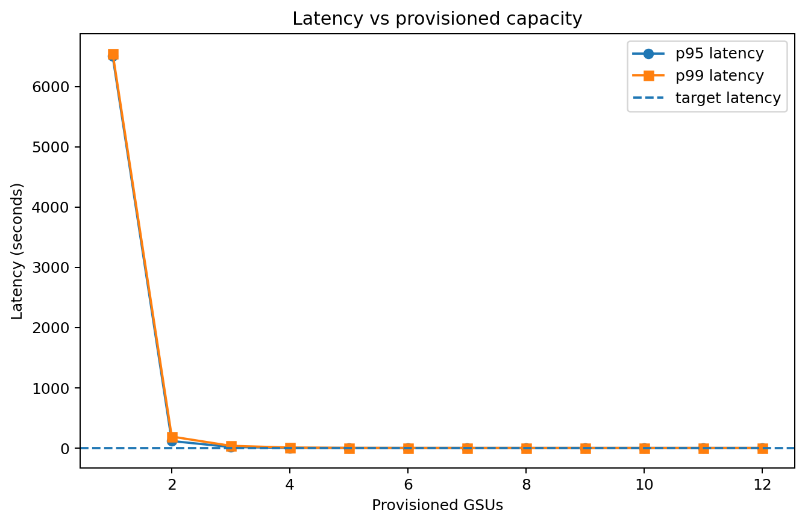
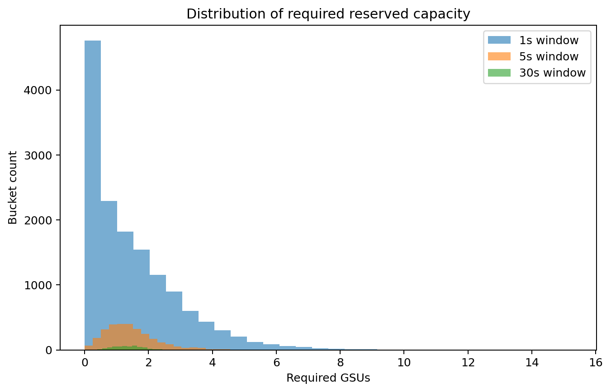
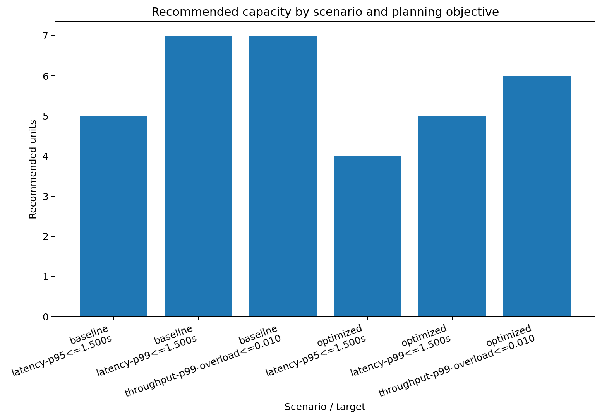
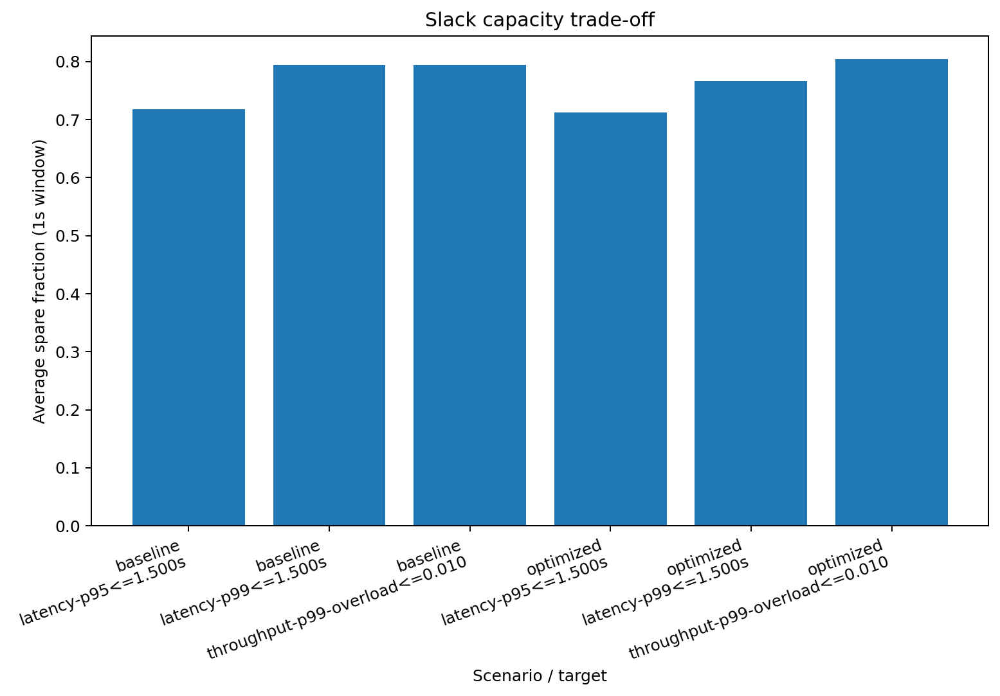

# slosizer: SLO-aware capacity planning for reserved LLM deployments

[](https://pypi.python.org/pypi/slosizer)
[](https://github.com/gojiplus/slosizer/actions?query=workflow%3Aci)
[](https://gojiplus.github.io/slosizer/)
[](https://pepy.tech/project/slosizer)


`slosizer` is a small Python package for sizing reserved LLM capacity against either a **throughput objective** or a **latency SLO**.

It takes request traces, converts them into provider-specific capacity work, simulates queueing under bursty arrivals, and tells you how many reserved units you should buy plus how much slack capacity you are likely to carry.

The package is built for the extremely normal situation where:

- you know your request shape better than your vendor calculator does,
- you care about p95 or p99 latency, not just average throughput,
- and you do not want your capacity plan to be a sacred spreadsheet that nobody trusts.

## What problem does this solve?

Reserved-capacity systems like GSU/PTU are fundamentally **throughput constructs**, but production teams usually care about **latency SLOs**, **burst risk**, and **headroom**.

`slosizer` gives you one place to:

1. **ingest** raw request logs into a canonical `RequestTrace`,
2. turn requests into provider-specific **adjusted work**,
3. plan capacity for either:
   - **throughput**: control overload probability or required-unit percentile,
   - **latency**: satisfy p95/p99 queue-aware latency targets,
4. quantify:
   - spare capacity,
   - overload probability,
   - expected overflow,
   - optimization benefit.

## What does "ingest" mean here?

It just means **map your raw logs into the clean columns the planner expects**.

If your real data has columns like `timestamp`, `prompt_tokens`, `completion_tokens`, `reasoning_tokens`, and `cache_hit_tokens`, the package standardizes that into a canonical `RequestTrace` with:

- `arrival_s`
- `class_name`
- `input_tokens`
- `cached_input_tokens`
- `output_tokens`
- `thinking_tokens`
- `max_output_tokens`
- `observed_latency_s`

That is all. No incense. No chanting.

## Quickstart

### 1) Create the environment with `uv`

```bash
uv sync --all-groups
```

### 2) Run the shipped synthetic demo

```bash
uv run python examples/quickstart.py
```

This writes:

- `examples/output/comparison.csv`
- `examples/output/latency_vs_capacity.png`
- `examples/output/required_units_distribution.png`
- `examples/output/scenario_benefit.png`
- `examples/output/percentile_tradeoff.png`

### 3) Run the checks

```bash
uv run pytest -q
uv run ruff check src tests examples
uv run ruff format --check src tests examples
uv run deptry .
uv run vulture
```

## Install and use it on your own trace

### Minimal latency-oriented example

```python
import pandas as pd
import slosizer as slz

df = pd.read_csv("requests.csv")

trace = slz.from_dataframe(
    df,
    schema=slz.RequestSchema(
        time_col="timestamp",
        class_col="route",
        input_tokens_col="prompt_tokens",
        cached_input_tokens_col="cached_prompt_tokens",
        output_tokens_col="completion_tokens",
        thinking_tokens_col="reasoning_tokens",
        max_output_tokens_col="max_output_tokens",
        latency_col="latency_s",
    ),
    provider="vertex",
    model="gemini-2.0-flash-001",
)

profile = slz.vertex_profile("gemini-2.0-flash-001")

result = slz.plan_capacity(
    trace,
    profile,
    slz.LatencyTarget(
        slz.LatencySLO(
            threshold_s=1.5,
            percentile=0.99,
            metric="e2e",
        )
    ),
)

print(result.recommended_units)
print(result.metrics)
```

### Throughput-oriented example

```python
import slosizer as slz

trace = slz.make_synthetic_trace(seed=42)
profile = slz.vertex_profile("gemini-2.0-flash-001")

result = slz.plan_capacity(
    trace,
    profile,
    slz.ThroughputTarget(
        percentile=0.99,
        max_overload_probability=0.01,
        windows_s=(1.0, 5.0, 30.0),
    ),
)

print(result.recommended_units)
print(result.slack_summary)
```

### Azure PTU example

Azure support is calibration-first: you seed a profile from the Azure calculator and benchmark results, then use the same planning machinery.

```python
import slosizer as slz

profile = slz.azure_profile(
    "gpt-4.1",
    throughput_per_unit=12000.0,
    input_weight=1.0,
    output_weight=4.0,
    thinking_weight=4.0,
)
```

## What data do you need?

You can start with only these three fields:

- `timestamp`
- `input_tokens`
- `output_tokens`

You get better plans when you also provide:

- `cached_input_tokens`
- `thinking_tokens`
- `max_output_tokens`
- `class_name`
- `latency_s`

See the concrete schema guide in [`docs/data-requirements.md`](docs/data-requirements.md).

There are also example input files in:

- [`examples/input/synthetic_request_trace_baseline.csv`](examples/input/synthetic_request_trace_baseline.csv)
- [`examples/input/synthetic_request_trace_optimized.csv`](examples/input/synthetic_request_trace_optimized.csv)

## Built-in provider support

### Vertex GSU
The package ships a small built-in registry for a handful of Vertex models, including:

- `gemini-2.0-flash-001`
- `gemini-2.0-flash-lite-001`
- `gemini-2.5-flash`
- `gemini-2.5-flash-lite`
- `gemini-2.5-pro`
- `gemini-3.1-flash-lite-preview`

### Azure PTU
Azure PTU support is user-calibrated on purpose. The package gives you the same planning engine, but you provide the model-specific PTU profile from your calculator + benchmark loop.

See [`docs/provider-adapters.md`](docs/provider-adapters.md).

## Synthetic demo: what it shows

The repo ships with a fake but bursty workload containing three classes:

- chat
- rag
- reasoning

The optimized variant simulates:

- tighter prompts,
- more caching,
- shorter outputs,
- lower thinking-token budgets.

That lets you inspect two things immediately:

1. **Optimization can reduce reserved-capacity needs.**
2. **Planning for stricter percentiles usually increases slack capacity.**

### Snapshot of the current synthetic outputs

| scenario | objective | target | recommended units | avg spare fraction (1s) | overload probability (1s) | achieved latency quantile |
| --- | --- | --- | ---: | ---: | ---: | ---: |
| baseline | latency | p95 <= 1.5s | 5 | 0.718 | 0.030 | 1.315s |
| baseline | latency | p99 <= 1.5s | 7 | 0.794 | 0.006 | 1.428s |
| baseline | throughput | p99 units, overload <= 1% | 7 | 0.794 | 0.006 | - |
| optimized | latency | p95 <= 1.5s | 4 | 0.713 | 0.032 | 1.157s |
| optimized | latency | p99 <= 1.5s | 5 | 0.766 | 0.012 | 1.278s |
| optimized | throughput | p99 units, overload <= 1% | 6 | 0.804 | 0.005 | - |

These numbers are synthetic. They are there to show the mechanics, not to cosplay as your production traffic.

### Output plots

**Latency vs provisioned capacity**



**Distribution of required reserved units**



**Optimization benefit**



**Slack trade-off**



## Repo map

- [`docs/formalization.md`](docs/formalization.md): generic throughput/latency model
- [`docs/data-requirements.md`](docs/data-requirements.md): what columns you need and why
- [`docs/provider-adapters.md`](docs/provider-adapters.md): how GSU/PTU adaptation works
- [`docs/examples.md`](docs/examples.md): the synthetic walkthrough
- [`examples/quickstart.py`](examples/quickstart.py): reproducible demo script

## Caveats

- The queue model is intentionally simple: FCFS fluid queueing, not a perfect service simulator.
- Built-in Vertex profiles are text-centric. Multimodal traffic needs more columns and weights.
- Azure PTU math is workload-sensitive, so the package does not fake vendor-authoritative PTU values for you.
- If you do not have a latency column, the package falls back to a simple token-based baseline latency model. That is a starting point, not gospel.

## Name

The package name is **`slosizer`** because "how many units do I need, and how much empty air am I buying to hit p99?" is the real question under all the vendor jargon.
