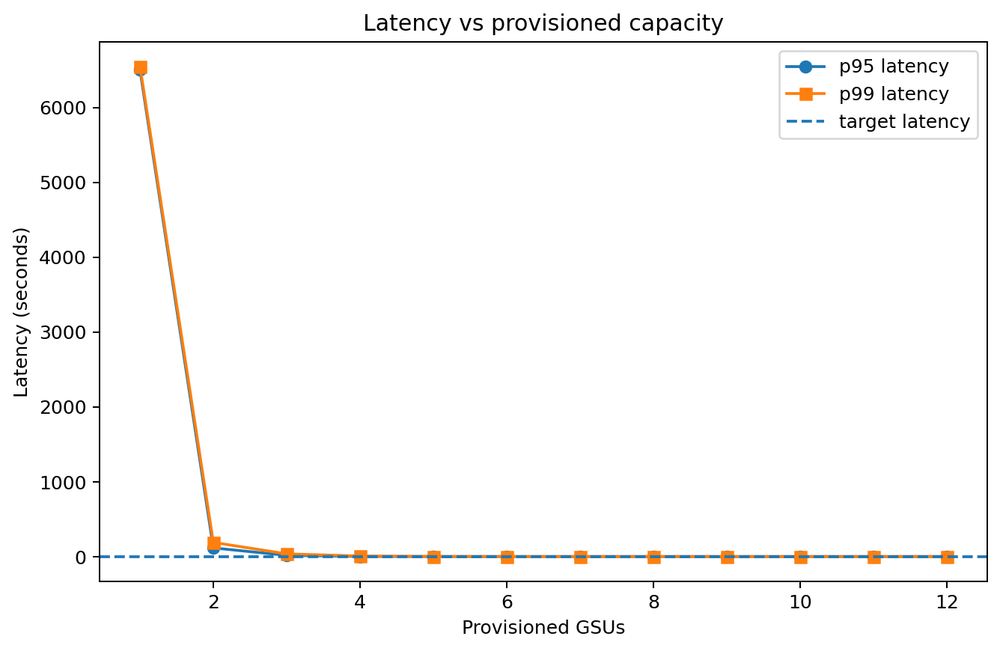
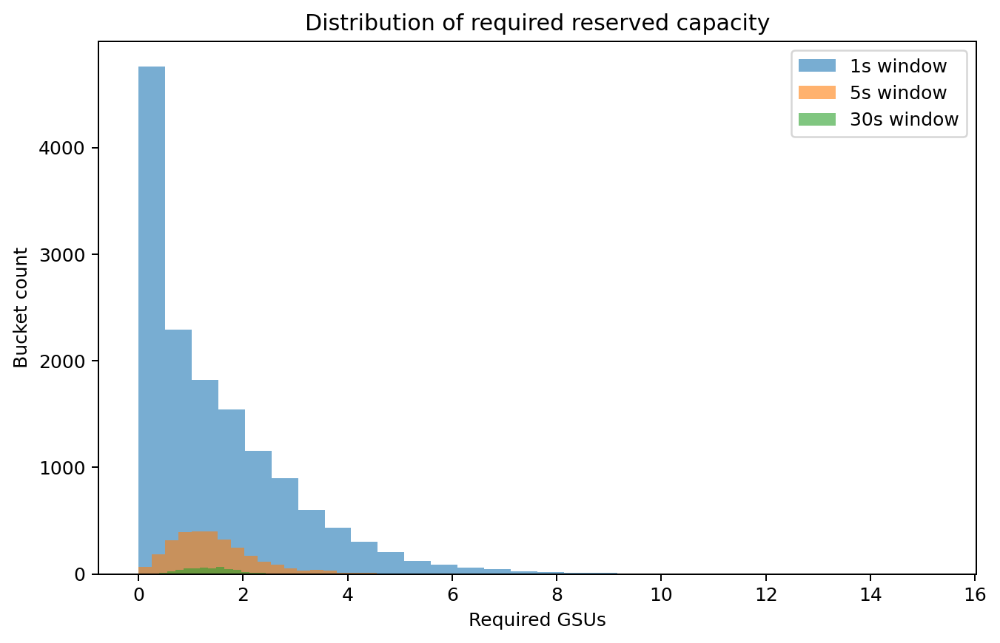
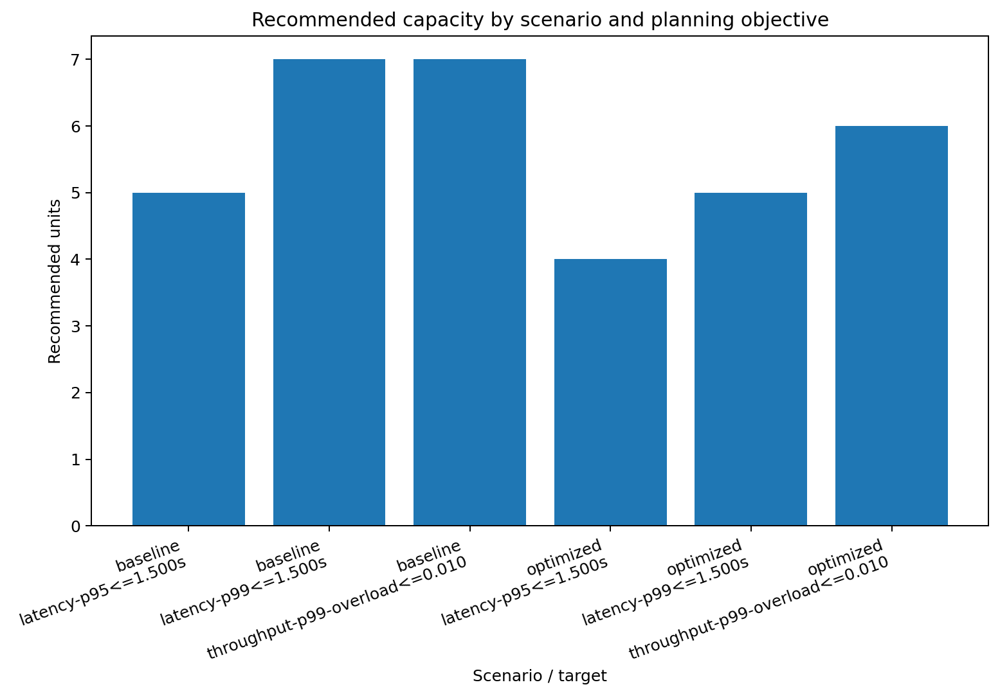
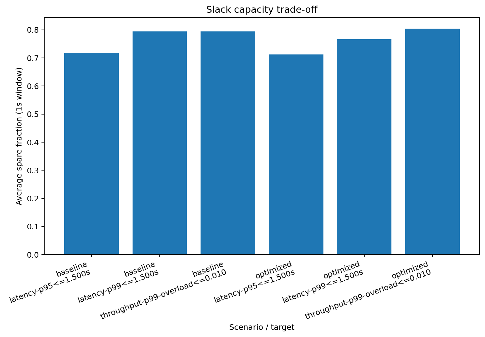

# Synthetic example walkthrough

Run the demo:

```bash
uv run python examples/quickstart.py
```

It generates these files:

- `examples/output/comparison.parquet`
- `examples/output/latency_vs_capacity.png`
- `examples/output/required_units_distribution.png`
- `examples/output/scenario_benefit.png`
- `examples/output/percentile_tradeoff.png`

## What the fake workload is doing

The synthetic trace contains three request classes:

- chat
- rag
- reasoning

The optimized scenario applies four changes:

- prompt compression
- more caching
- tighter generation caps
- reduced thinking-token budgets

## Current synthetic results

`examples/output/comparison.parquet` is generated directly by the demo and is
the authoritative result table. The command also prints that table for quick
inspection, so no second set of numbers is maintained in the documentation.

## Rendered plots

### Latency vs capacity



### Distribution of required units



### Optimization benefit



### Percentile vs slack trade-off



The important pattern is not the exact number. It is that stricter tail planning tends to buy more slack, while prompt/token optimizations can collapse the tail and shrink the reserved-capacity bill.
